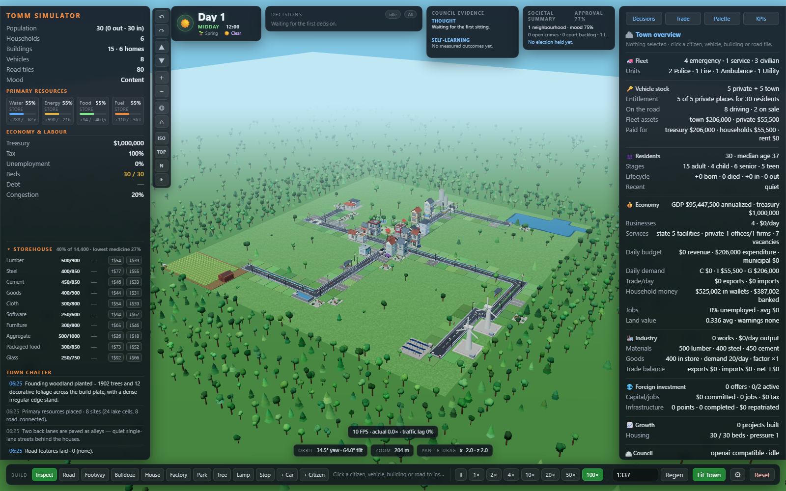

# Town of Many Minds

**TOMM** is a browser-based 3D town simulator for observing how an LLM governs a changing town. Five Cabinet ministers propose actions, a sixth Council call selects priorities, and the Mayor validates the resulting motions. Residents, private developers, traffic, industry, and public services continue through their own simulation systems.



The experiment measures decisions and consequences: Can a model maintain food supply, create viable jobs, manage public debt, and expand a road network without wasting land? Council traits emerge from choices and recorded outcomes rather than a prescribed personality.

## Run locally

Use **Node.js 22.12+**, npm, and a browser with WebGL support. Development and regression work has also used Node.js 24.

```sh
git clone https://github.com/abanerjee84/town-of-many-minds.git
cd town-of-many-minds
npm ci
npm run dev
```

Open the address Vite prints, usually **http://localhost:5173**. For autonomous public decisions, run an OpenAI-compatible local model server on **http://localhost:1234** with a loaded model; Vite forwards `/lm/v1` requests to it. See [local model setup](docs/getting-started.md) and the [provider contract](docs/council.md#connecting-a-provider).

Without a responding model, you can inspect the town and use manual construction tools. The default Council mode does not replace a failed LLM call with automatic public construction.

## What the town simulates

| Area | Implemented behaviour |
| --- | --- |
| Governance | Five department-specific calls, Council synthesis, Mayor validation, immediate remedy correction, bounded outcome memory |
| Land and buildings | A compact acquired founding town inside a 100 × 100 plate; paid frontier acquisition, horizontal footprints, floors, wings, civic upgrades, residential communities |
| Economy and work | Separate public/private accounts, taxes and municipal fees, household savings, wages, loans and bonds, developer acceptance, training and service-sector jobs |
| Industry | Capacity-scaled factories, input recipes, shared commodity inventories, dynamic prices, imports and exports |
| Mobility | Congestion evidence across sittings, graph-based street evaluation, road upgrades, bridges, parking, buses, signals and emergency fleets |
| Civic life | Schools and healthcare, neighbourhoods, mood and approval, crime and justice records, elections, schemes and laws |
| Environment | Seasons, visible weather, day/night lighting, fog and sky, woodland, clearing and planting linked to lumber |
| Evaluation | Inspectable decisions, KPI panel and JSON export, provider benchmarks, pre-sitting MapNow text exports, forced-request regressions |

The starting defaults include **$1,000,000 treasury**, **30 founding residents**, **100× speed**, **two Council sittings per day**, **up to five approved motions per sitting**, and **shadows off**. Residential capacity is **three residents per footprint tile per floor**. These are model rules, not real-world forecasts.

## Explore the documentation

- [Start and connect a local model](docs/getting-started.md)
- [Controls, panels and settings](docs/user-guide.md)
- [Council, Cabinet, Mayor and provider API](docs/council.md)
- [World, placement and building progression](docs/world-construction.md)
- [Economy, employment, factories and investment](docs/economy-employment.md)
- [Road planning, traffic and public transport](docs/mobility.md)
- [Society, resources, seasons and forestry](docs/society-environment.md)
- [Kit system and extension guide](docs/kits.md)
- [KPIs, benchmarking and MapNow](docs/evaluation.md)
- [All documentation and reference tables](docs/README.md)

## Develop and verify

```sh
npm run build
npm run docs:check
npx playwright install chromium
```

Browser regressions require a running Vite server. In another terminal:

```powershell
$env:APP_URL = 'http://localhost:5173'
npm run test:cabinet-remedy
npm run test:kit-registry
```

See [testing](docs/testing.md) for the full command list, forced requests, and horizon-test costs. [Architecture](docs/architecture.md), [configuration](docs/configuration.md), and [contributing](CONTRIBUTING.md) explain where changes belong.

## Project status

TOMM is an experimental simulator. The browser owns the live run; background tabs are throttled, and public decision calls temporarily hold simulation time. Large towns can advance the calendar faster than their bounded traffic budget. A strict long-run bus/refuelling regression still has an unresolved queue/completion failure. A simulation Web Worker remains planned work.

See [known limitations](docs/troubleshooting.md#known-limitations), the [SRS](BuildContracts/SRS.md), and [TODO](BuildContracts/TODO.md) for measured status. Making this repository public does not introduce a software licence; no `LICENSE` file is currently supplied.
