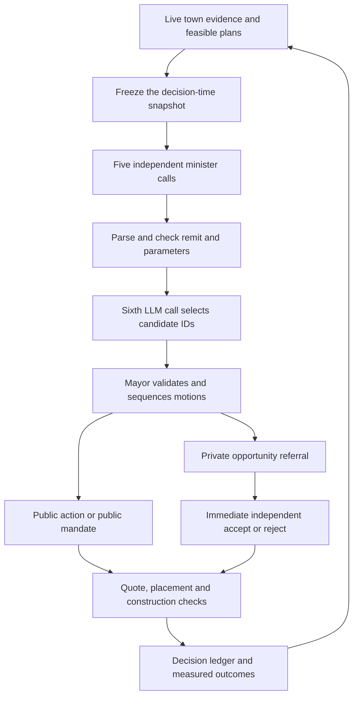

# Council, Cabinet and Mayor

## One sitting



The default schedule is two evenly spaced decision windows per game day. Settings allow 1–12. The five ministers are requested concurrently, each with a separate system prompt and departmental evidence. Lowering the approval cap does not skip a department's call.

The sixth call sees admitted candidate IDs and a compact town report. It selects and prioritizes those candidates; it cannot invent a new motion. If synthesis fails or returns an invalid selection, the existing priority-mix fallback operates on the ministers' admitted candidates. That is not permission for a deterministic system to invent a public action.

The Mayor is a **validation and sequencing component**, not a seventh LLM role. It checks remit, duplication, approval limits and mandatory prerequisites. Multiple approved motions can start in one sitting. A decision is still subject to live feasibility, financing, capacity and placement checks at enactment.

The simulation holds calendar/agent progression while governance is pending so the model does not act on a moving snapshot. Each provider request receives a 20-second abort signal. A regeneration or superseded request invalidates late replies.

## Department remits

| Department | Main evidence and responsibilities |
| --- | --- |
| Treasury & Economy | Solvency, productive capacity, unemployment, material stocks, trade, taxes, finance and foreign investment |
| Land & Housing | Housing pressure, parcel availability, acquisition, zoning, density and building progression |
| Infrastructure & Mobility | Between-sitting congestion, connectivity, useful street changes, parking and transit |
| Public Services & Utilities | Food and other primary capacity, water/power/sewage, civic and emergency coverage |
| Society, Education & Culture | Mood, approval, education, safety, culture, recreation, schemes and archetype design |

The remits, owned intent lists and department prompt text live in [cabinet.json](../src/data/cabinet.json). Some civic intents are intentionally shared. The [intent reference](reference/intents.md) lists the current ownership rather than inferring it from an action name.

Prompts target roughly 70% immediate priorities and 30% longer-term work when both are available. This is a prompt/selection policy across the slate, not a guaranteed random distribution for individual intents. The Treasury prompt gives solvency a prime directive while preserving essential services and reserves.

## Reports and constraints

The report includes feasible and blocked work, mandatory remedies, population and housing pressure, resources, current construction, fiscal evidence, jobs, service loads, traffic, industry, and department-specific observations. Ministers receive compact subsets, not the entire simulation state.

The system contract has a 4,000-token budget constant. Compact reports have character limits (3,600 for ministers, 4,000 for synthesis); token checks use approximations, not the exact tokenizer of every provider. Essential complete rows survive before optional catalogue detail. The model must use current catalogue IDs and parameters rather than invent coordinates, amounts, IDs or actions.

When a resource prerequisite blocks every selected motion, the owning minister gets **one bounded corrective call in the same sitting**. The fresh prompt asks for the exact remedy and resource. A funded, placed remedy starts through the normal action path. Original Council-selected motions can then resume in that sitting within its remaining cap. Resolved or already-underway remedies no longer impose a stale veto.

An invalid/refused correction does not cause automatic spending. A wrong-resource upgrade does not satisfy another resource's constraint. A financing bridge such as a bond directive remains current only while the underlying emergency plan still fails its financing quote.

## Reply formats

A minister returns one motion:

```json
{
  "motions": [{
    "department": "services",
    "intent": "UPGRADE_RESOURCE",
    "reason": "Food production is below the reported demand",
    "priority": 1,
    "params": { "resource": "food" }
  }]
}
```

Council synthesis selects provided candidate IDs:

```json
{
  "selected": [{
    "id": "motion-1",
    "priority": 1,
    "reason": "Resolve the reported food capacity prerequisite"
  }]
}
```

The parser also supports legacy `INTENT: BUILD_FACTORY type=cement` text for diagnostics and older integrations. Bare typed builds are not a substitute for a catalogue parameter. See [intent reference](reference/intents.md).

## Connecting a provider

The default adapter sends `messages`, `temperature`, `max_tokens`, and an optional `model` to an OpenAI-compatible chat-completions URL. It normalizes `choices[0].message.content`, model, usage and raw reply.

The browser exposes a custom-provider boundary:

```js
registerLLMProvider({
  id: 'my-local-council',
  label: 'My local Council',
  async complete(request) {
    // Forward request.messages, model, temperature and maxTokens.
    // Honour request.signal. request.department identifies the caller.
    const reply = await myModelClient(request);
    return { text: reply.text, model: reply.model, usage: reply.usage };
  }
});

town.governance.setProvider('my-local-council');
```

`myModelClient` is your integration, not a built-in API. Custom code must implement abort handling; merely accepting `signal` does not bound a provider that ignores it. Providers can route `department` to different local models while keeping the same parser and execution contracts.

Authentication is supplied by an adapter or server-side gateway, not the Settings modal. Do not embed a hosted-provider secret in client source. [Deployment](deployment.md) explains the Vite proxy boundary.

## Learning and agency

Council learning stores bounded before/after measures for choices: treasury, population, beds, mood, approval, jobs, traffic, shortages, accessibility and construction. It is evidence memory, not weight training or a guarantee of causal attribution. Persona derives from recorded decisions. Neither learning nor prose can alter the action registry or accounting guards.

Private opportunities are referred for immediate acceptance or rejection. Developers also review their own market on an independent game-time cadence. A Council recommendation does not oblige a private individual to finance a project. Public housing is explicitly requested with `program=social_housing`; ordinary housing remains a private opportunity. See [economy and employment](economy-employment.md).
